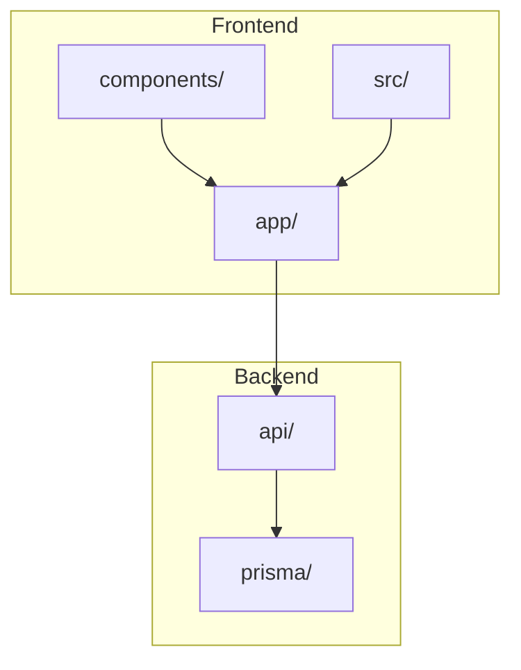
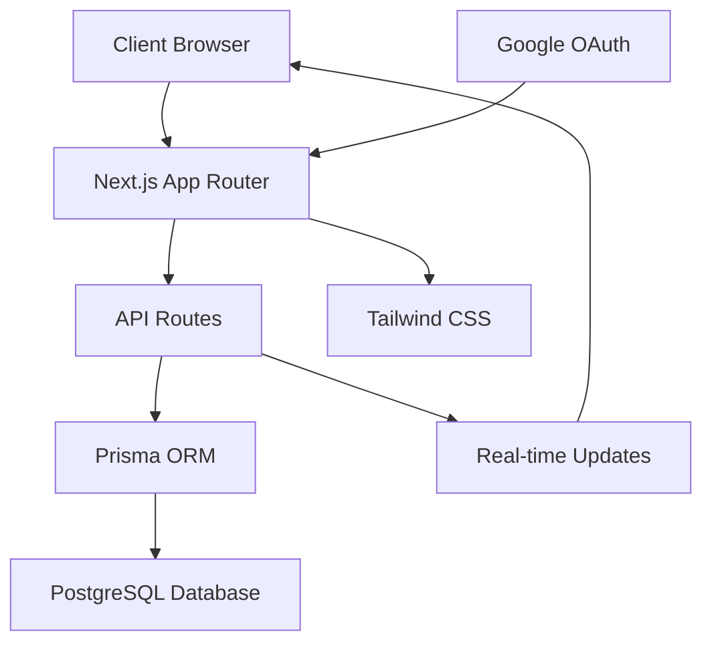
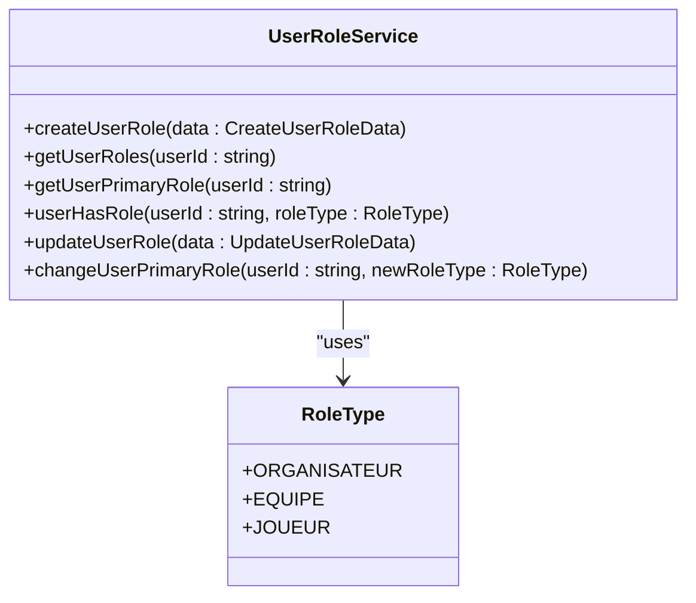
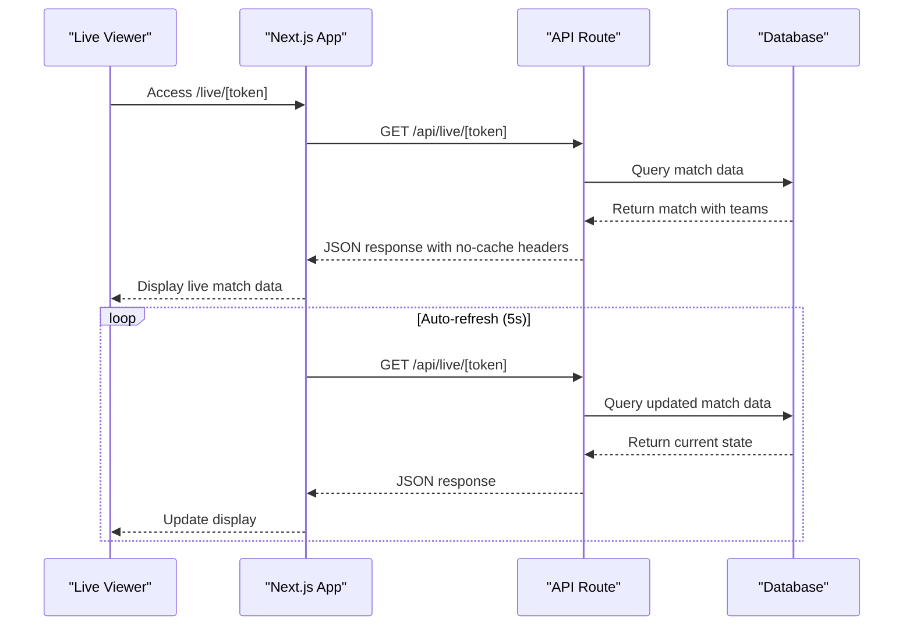
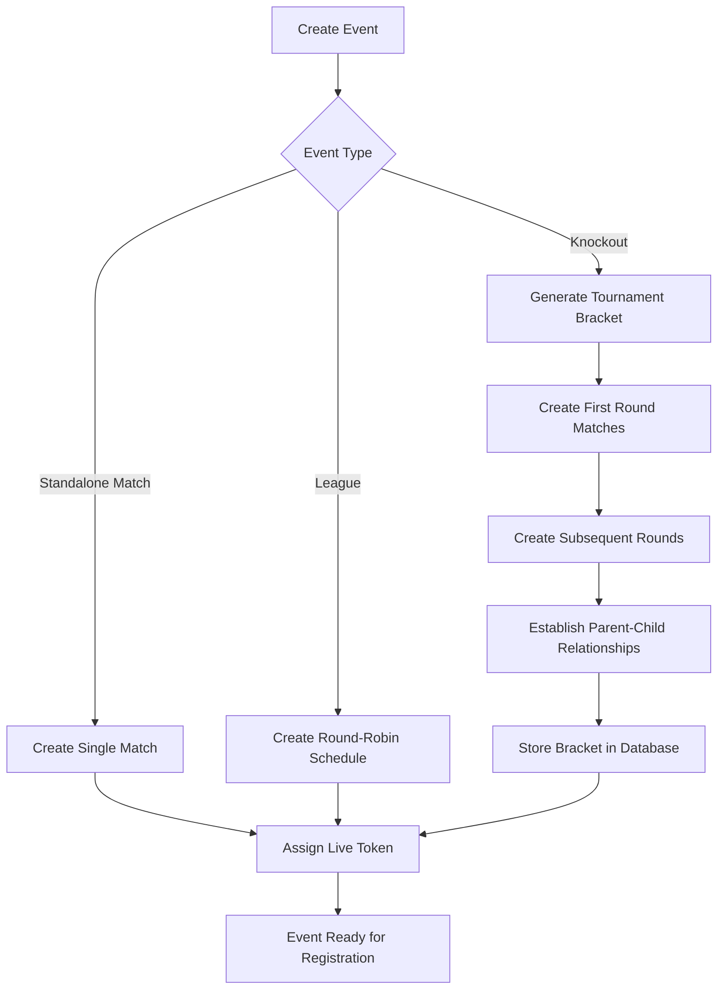
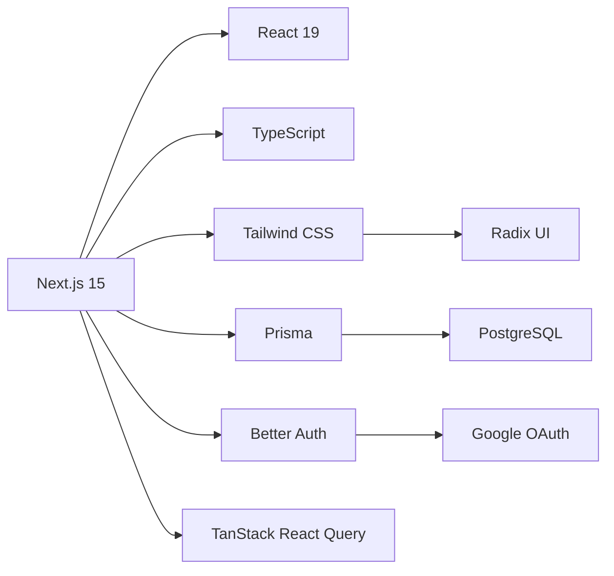

# System Overview

<cite>
**Referenced Files in This Document**   
- [README.md](file://README.md)
- [app/api/auth/[...all]/route.ts](file://app/api/auth/[...all]/route.ts)
- [src/lib/auth.ts](file://src/lib/auth.ts)
- [src/lib/user-roles.ts](file://src/lib/user-roles.ts)
- [app/api/live/[token]/route.ts](file://app/api/live/[token]/route.ts)
- [app/live/[token]/page.tsx](file://app/live/[token]/page.tsx)
- [src/types/match.ts](file://src/types/match.ts)
- [src/types/event.ts](file://src/types/event.ts)
- [src/types/tournament.ts](file://src/types/tournament.ts)
</cite>

## Table of Contents
1. [Introduction](#introduction)
2. [Project Structure](#project-structure)
3. [Core Components](#core-components)
4. [Architecture Overview](#architecture-overview)
5. [Detailed Component Analysis](#detailed-component-analysis)
6. [Dependency Analysis](#dependency-analysis)
7. [Performance Considerations](#performance-considerations)
8. [Troubleshooting Guide](#troubleshooting-guide)
9. [Conclusion](#conclusion)

## Introduction
BigMatch is a full-stack sports event management platform built with Next.js 15, React 19, and TypeScript. It enables users to create and manage tournaments, handle team registrations, track matches in real-time, and maintain rankings. The system supports three primary user roles: Organizer, Team, and Player, each with distinct workflows and access levels. This document provides a comprehensive overview of the system's architecture, user roles, key entry points, and technical implementation.

**Section sources**
- [README.md](file://README.md)

## Project Structure
The BigMatch application follows a structured directory layout based on the Next.js App Router pattern. The `app` directory contains all pages and API routes, organized by feature. The `components` directory houses reusable UI components, while `src` contains business logic, hooks, and type definitions. The `prisma` directory manages database schema and migrations. Key directories include:
- `app/actions`: Server actions for authentication
- `app/api`: API routes for authentication, events, matches, and real-time features
- `app/dashboard`: Role-specific dashboards for organizers, teams, and players
- `components/ui`: Base UI components built with Radix UI
- `src/hooks`: Custom React hooks for data fetching and state management
- `src/lib`: Core utilities including authentication and database clients

**Diagram sources**
- [README.md](file://README.md)

## Core Components
The core components of BigMatch include the authentication system, event management, match tracking, and real-time capabilities. The platform uses Better Auth for secure Google OAuth integration and role-based access control. Event creation and management are handled through a multi-step form in the `create-event` directory, while match tracking is enabled through the `matches` API routes and live viewing functionality. The system supports different tournament types including leagues, playoffs, and standalone matches.

**Section sources**
- [README.md](file://README.md)
- [src/lib/auth.ts](file://src/lib/auth.ts)
- [src/lib/user-roles.ts](file://src/lib/user-roles.ts)

## Architecture Overview
BigMatch follows a modern full-stack architecture with a Next.js frontend, RESTful API routes, and a PostgreSQL database managed through Prisma ORM. The system uses a client-server model where the frontend communicates with backend API routes for data operations. Authentication is handled by Better Auth, which provides secure session management and social login capabilities. Real-time features are implemented through periodic polling of API endpoints with appropriate cache control headers.

**Diagram sources**
- [src/lib/auth.ts](file://src/lib/auth.ts)
- [app/api/auth/[...all]/route.ts](file://app/api/auth/[...all]/route.ts)
- [prisma/migrations](file://prisma/migrations)

## Detailed Component Analysis

### User Role System
The user role system in BigMatch defines three primary roles: Organizer, Team, and Player. These roles are managed through the `UserRoleService` class which handles creation, activation, and deactivation of roles. The system uses a many-to-many relationship between users and roles, allowing users to have multiple roles with an active status flag. Role changes are secured through API endpoints that validate user permissions before making changes.

**Diagram sources**
- [src/lib/user-roles.ts](file://src/lib/user-roles.ts)
- [src/types/event.ts](file://src/types/event.ts)

### Real-time Match Tracking
The real-time match tracking feature allows users to view live match data through a token-based system. When a match is created, a unique live token is generated and shared with viewers. The `/api/live/[token]` endpoint provides current match data with no-cache headers to ensure fresh data is always served. The frontend implements auto-refresh functionality that polls the API every 5 seconds when enabled.

**Diagram sources**
- [app/api/live/[token]/route.ts](file://app/api/live/[token]/route.ts)
- [app/live/[token]/page.tsx](file://app/live/[token]/page.tsx)
- [src/types/match.ts](file://src/types/match.ts)

### Event and Tournament Management
The event management system supports multiple event types including standalone matches, leagues, and knockout tournaments. Events have a defined lifecycle with statuses such as draft, registration_open, in_progress, and completed. For knockout tournaments, the system implements a draw mechanism that generates a tournament bracket with rounds and match positions. The bracket generation ensures proper seeding and parent-child match relationships for tournament progression.

**Diagram sources**
- [src/types/tournament.ts](file://src/types/tournament.ts)
- [app/api/draws/[eventId]/route.ts](file://app/api/draws/[eventId]/route.ts)
- [src/types/event.ts](file://src/types/event.ts)

## Dependency Analysis
BigMatch has a well-defined dependency structure with clear separation between frontend and backend concerns. The application depends on Next.js 15 for server-side rendering and routing, React 19 for component management, and TypeScript for type safety. The database layer uses Prisma ORM with PostgreSQL as the underlying database. Authentication is provided by Better Auth with Google OAuth integration. State management on the client side uses TanStack React Query for data fetching and caching.

**Diagram sources**
- [package.json](file://package.json)
- [prisma/schema.prisma](file://prisma/schema.prisma)
- [src/lib/auth.ts](file://src/lib/auth.ts)

## Performance Considerations
The system implements several performance optimizations including server-side rendering for improved initial load times, efficient database queries through Prisma's query optimization, and client-side data caching with React Query. The real-time features use selective polling rather than WebSockets to reduce server load, with the option to disable auto-refresh for users with limited bandwidth. Database migrations are managed through Prisma's migration system to ensure schema consistency across environments.

**Section sources**
- [README.md](file://README.md)
- [prisma/migrations](file://prisma/migrations)

## Troubleshooting Guide
Common issues in BigMatch typically relate to database connectivity, authentication configuration, and environment variables. The system requires a properly configured PostgreSQL database with the connection URL specified in the DATABASE_URL environment variable. Authentication through Google OAuth requires valid GOOGLE_CLIENT_ID and GOOGLE_CLIENT_SECRET values. The AUTH_SECRET environment variable must be set to a secure random string for session encryption. Database issues can often be resolved by running `pnpm prisma generate` and `pnpm prisma migrate dev` to ensure the client is up-to-date and migrations are applied.

**Section sources**
- [README.md](file://README.md)
- [src/lib/auth.ts](file://src/lib/auth.ts)

## Conclusion
BigMatch provides a comprehensive platform for sports event management with a modern tech stack and well-structured architecture. The system effectively separates concerns between frontend and backend, uses industry-standard tools for authentication and database management, and provides real-time capabilities for live match tracking. The role-based access control system enables different user types to interact with the platform according to their responsibilities. The application is deployable on Vercel and other Next.js-compatible platforms, making it suitable for both development and production use.