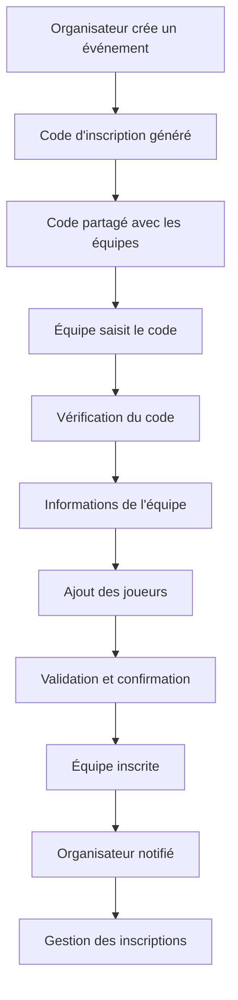

# Système d'Inscription via Code - BigMatch

## Vue d'ensemble

Le système d'inscription via code d'inscription permet aux équipes de s'inscrire facilement aux événements sportifs en utilisant un code unique fourni par l'organisateur. Ce système simplifie le processus d'inscription et offre une gestion centralisée des participants.

## Fonctionnalités

### 🎯 Pour les Organisateurs

- **Génération automatique de codes** : Chaque événement reçoit un code d'inscription unique
- **Gestion des inscriptions** : Suivi des équipes inscrites en temps réel
- **Export des données** : Export CSV des inscriptions pour analyse
- **Communication** : Contact direct avec les équipes inscrites
- **Statistiques** : Vue d'ensemble des participants et places disponibles

### 🏆 Pour les Équipes

- **Inscription simplifiée** : Processus en 4 étapes guidées
- **Gestion des joueurs** : Ajout/suppression de joueurs dynamique
- **Upload de logo** : Personnalisation de l'identité de l'équipe
- **Confirmation automatique** : Validation immédiate de l'inscription

## Architecture Technique

### Base de Données

```sql
-- Table des événements
CREATE TABLE event (
  id UUID PRIMARY KEY DEFAULT gen_random_uuid(),
  name TEXT NOT NULL,
  description TEXT,
  type TEXT NOT NULL,
  date TIMESTAMP NOT NULL,
  time TEXT,
  location TEXT,
  rules JSONB,
  registration_code TEXT UNIQUE NOT NULL,
  max_teams INTEGER,
  max_players INTEGER,
  status TEXT DEFAULT 'DRAFT',
  organizer_id UUID NOT NULL REFERENCES user(id) ON DELETE CASCADE,
  created_at TIMESTAMP DEFAULT NOW(),
  updated_at TIMESTAMP DEFAULT NOW()
);

-- Table des équipes
CREATE TABLE team (
  id UUID PRIMARY KEY DEFAULT gen_random_uuid(),
  name TEXT NOT NULL,
  description TEXT,
  logo TEXT,
  sport TEXT,
  event_id UUID NOT NULL REFERENCES event(id) ON DELETE CASCADE,
  created_at TIMESTAMP DEFAULT NOW(),
  updated_at TIMESTAMP DEFAULT NOW()
);

-- Table des joueurs
CREATE TABLE player (
  id UUID PRIMARY KEY DEFAULT gen_random_uuid(),
  name TEXT NOT NULL,
  email TEXT,
  phone TEXT,
  position TEXT,
  number INTEGER,
  team_id UUID NOT NULL REFERENCES team(id) ON DELETE CASCADE,
  created_at TIMESTAMP DEFAULT NOW(),
  updated_at TIMESTAMP DEFAULT NOW()
);
```

### Routes API

#### GET `/api/inscription?code={code}`

Récupère les informations d'un événement via son code d'inscription.

**Réponse :**

```json
{
  "success": true,
  "data": {
    "id": "uuid",
    "name": "Tournoi de Basketball 2024",
    "type": "CUP",
    "date": "2024-12-15T00:00:00Z",
    "maxTeams": 16,
    "currentTeams": 8,
    "status": "ACTIVE"
  }
}
```

#### POST `/api/inscription`

Enregistre une nouvelle équipe pour un événement.

**Corps de la requête :**

```json
{
  "registrationCode": "FOOT24",
  "teamData": {
    "name": "Les Champions",
    "description": "Équipe expérimentée",
    "sport": "Football",
    "logo": "logo.jpg",
    "players": [
      {
        "name": "Jean Dupont",
        "email": "jean@champions.com",
        "phone": "06 12 34 56 78",
        "position": "Attaquant",
        "number": 10
      }
    ]
  }
}
```

## Interface Utilisateur

### Page d'Accueil (`/inscription`)

- **Formulaire de saisie du code** : Interface claire et intuitive
- **Explications du processus** : Guide étape par étape
- **Avantages du système** : Mise en avant des bénéfices
- **Types d'événements supportés** : Informations sur les formats disponibles

### Processus d'Inscription (`/inscription/[code]`)

1. **Vérification du code** : Validation et récupération des informations de l'événement
2. **Informations de l'équipe** : Nom, description, sport et logo
3. **Gestion des joueurs** : Ajout des informations de chaque joueur
4. **Confirmation** : Récapitulatif et validation finale

### Gestion des Inscriptions (`/dashboard/organisateur/inscriptions`)

- **Sélection d'événement** : Choix parmi les événements créés
- **Vue d'ensemble** : Statistiques et métriques clés
- **Liste des équipes** : Détails complets avec filtres et recherche
- **Actions** : Contact, suppression et export des données

## Workflow d'Inscription



## Sécurité et Validation

### Vérifications

- **Code d'inscription** : Validation de l'existence et de la validité
- **Statut de l'événement** : Seuls les événements "ACTIVE" acceptent les inscriptions
- **Limites** : Respect du nombre maximum d'équipes et de joueurs
- **Données** : Validation des champs obligatoires et format des données

### Contrôles d'Accès

- **Organisateurs** : Accès uniquement à leurs propres événements
- **Codes uniques** : Chaque événement a un code d'inscription distinct
- **Audit trail** : Horodatage de toutes les inscriptions

## Fonctionnalités Avancées

### Export des Données

- **Format CSV** : Compatible avec Excel et autres outils d'analyse
- **Données incluses** : Informations complètes des équipes et joueurs
- **Nommage automatique** : Fichiers nommés selon l'événement

### Communication

- **Contact direct** : Envoi d'emails aux équipes inscrites
- **Notifications** : Alertes automatiques pour nouvelles inscriptions
- **Statuts** : Suivi des inscriptions en temps réel

### Personnalisation

- **Logos d'équipe** : Upload et gestion des images
- **Informations détaillées** : Champs personnalisables selon le sport
- **Numéros de joueurs** : Attribution automatique ou manuelle

## Utilisation

### Pour les Organisateurs

1. **Créer un événement** via le dashboard organisateur
2. **Partager le code** d'inscription avec les équipes
3. **Surveiller les inscriptions** en temps réel
4. **Gérer les participants** via l'interface dédiée
5. **Exporter les données** pour analyse et communication

### Pour les Équipes

1. **Recevoir le code** d'inscription de l'organisateur
2. **Saisir le code** sur la page d'inscription
3. **Remplir les informations** de l'équipe
4. **Ajouter les joueurs** avec leurs détails
5. **Confirmer l'inscription** et recevoir la validation

## Maintenance et Support

### Monitoring

- **Logs d'inscription** : Suivi de toutes les tentatives d'inscription
- **Erreurs** : Gestion et reporting des problèmes
- **Performance** : Métriques de temps de réponse et disponibilité

### Mises à Jour

- **Nouveaux formats** : Support de nouveaux types d'événements
- **Améliorations UI/UX** : Interface utilisateur en constante évolution
- **Intégrations** : Connexion avec d'autres systèmes de gestion sportive

## Conclusion

Le système d'inscription via code d'inscription de BigMatch offre une solution complète et professionnelle pour la gestion des événements sportifs. Il simplifie le processus d'inscription tout en donnant aux organisateurs un contrôle total sur leurs événements et participants.

Cette approche moderne et intuitive améliore l'expérience utilisateur tout en réduisant la charge administrative pour les organisateurs d'événements sportifs.
